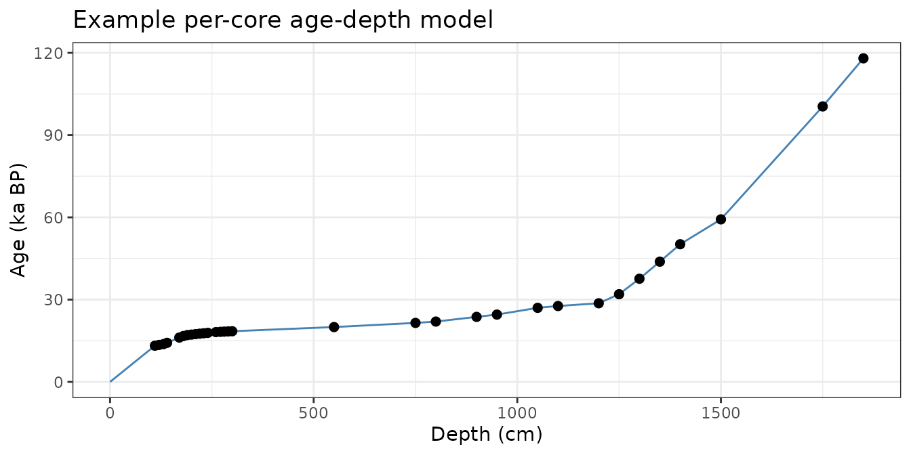
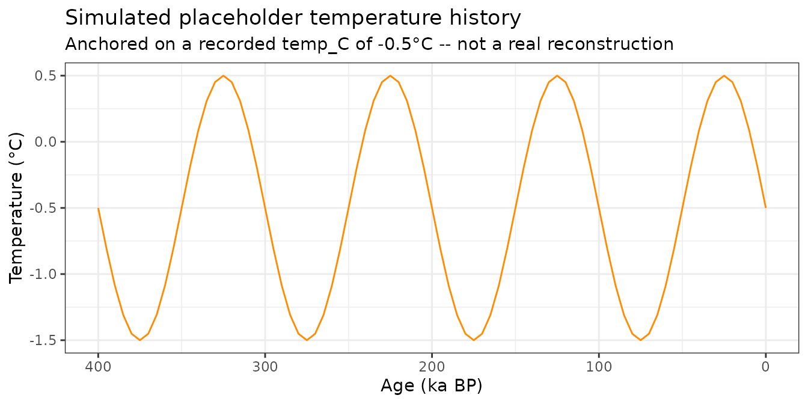
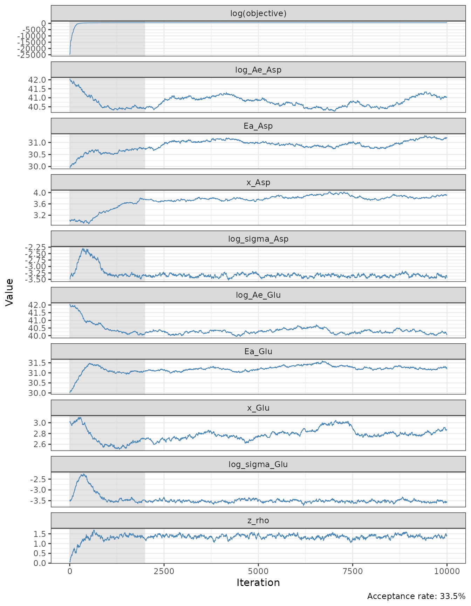
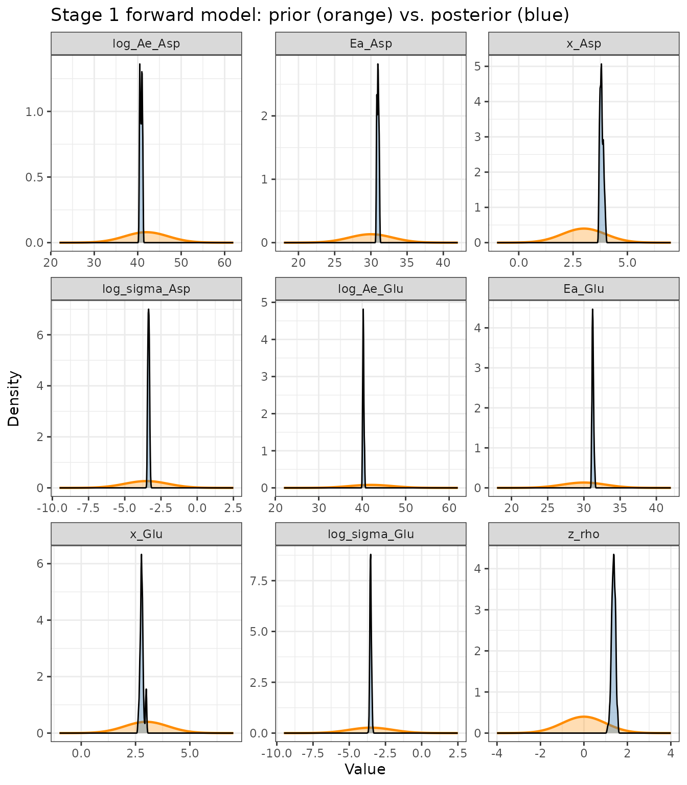
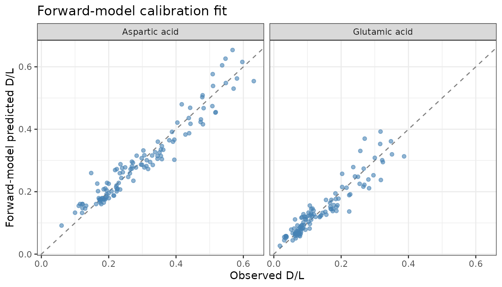
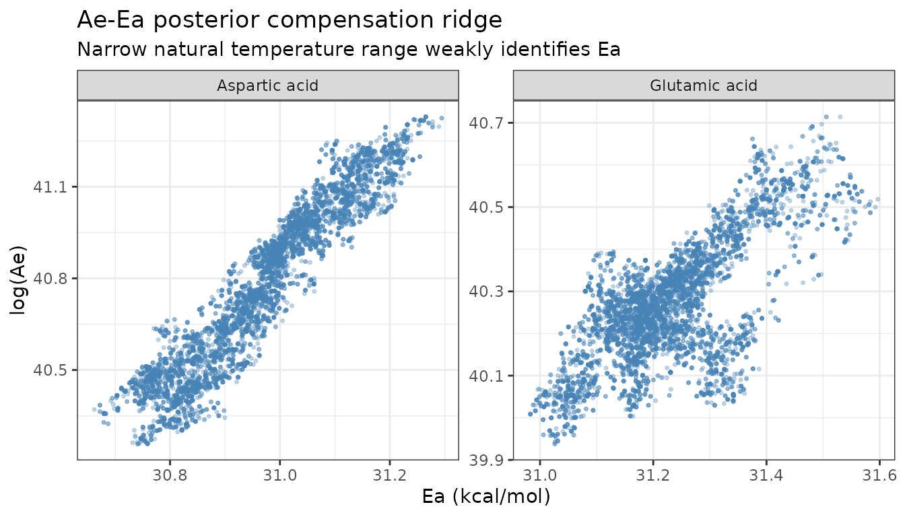
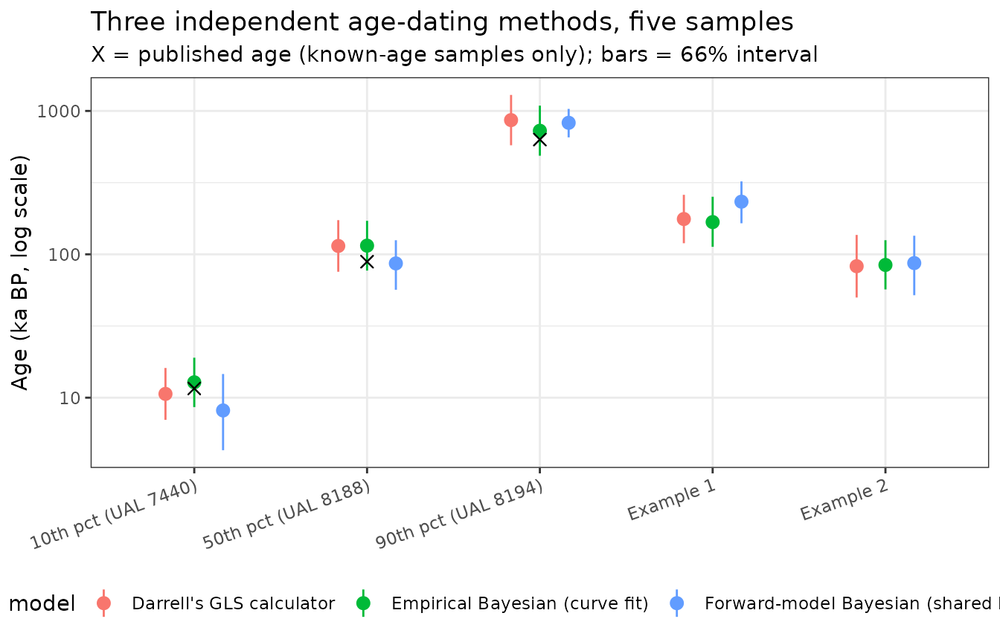
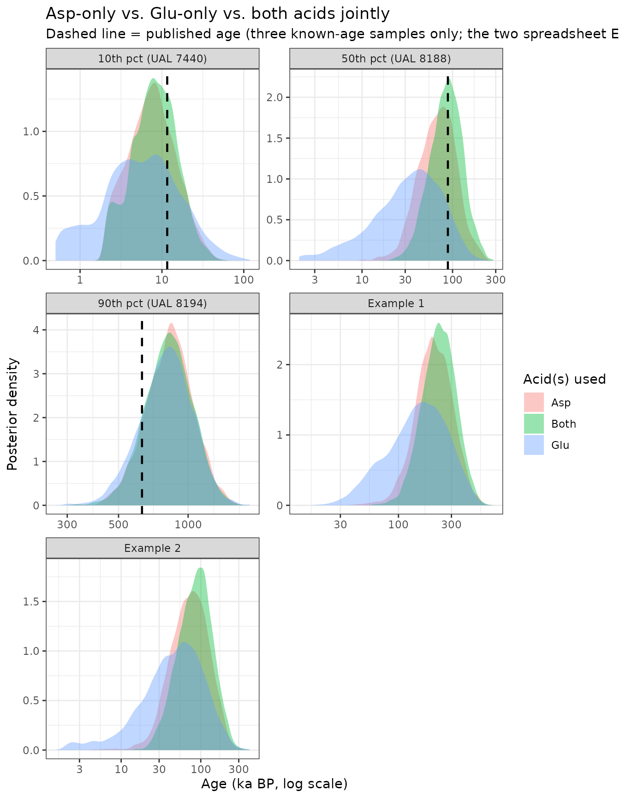
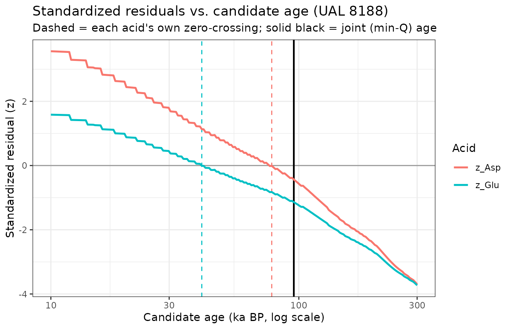
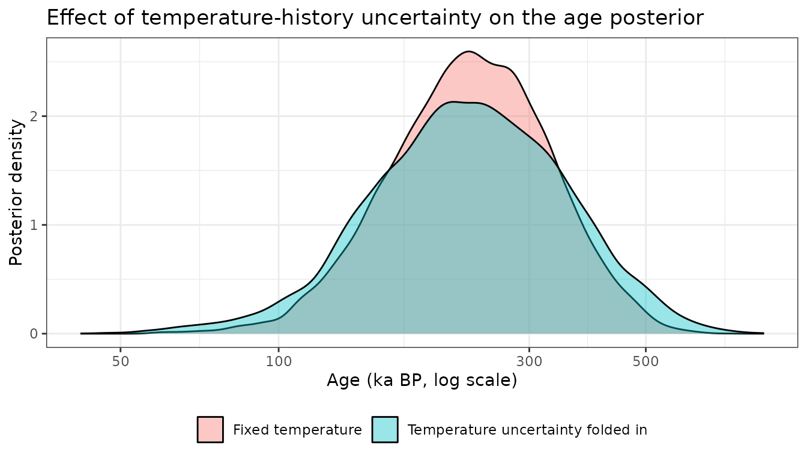

# Two-Acid Age Dating: A Shared Forward Model (Asp + Glu)

## Overview

[`vignette("two-acid-age-inversion")`](https://nickmckay.github.io/AARP/articles/two-acid-age-inversion.md)
builds a Bayesian two-acid age model that reproduces an in-prep Np AAR
age calculator: aspartic acid (Asp) is fit with a “time-dependent
kinetics” (TDK) curve, glutamic acid (Glu) with a “simple power-law
kinetics” (SPK) curve – two different empirical curve *forms*, each fit
by regressing `log(age)` on `log(f(D/L))`.

This vignette takes a different starting point: **Asp and Glu should
racemize according to the same underlying chemistry** – the TDK/SPK
split is a curve-fitting convenience for getting the best empirical fit
to each acid, not evidence of different reaction mechanisms. So instead
of two curve forms, this vignette fits **one shared kinetic model** (the
same Arrhenius + Bada power-law model already used for isoleucine
elsewhere in this package:
[`arrhenius()`](https://nickmckay.github.io/AARP/reference/arrhenius.md),
[`dRacPL()`](https://nickmckay.github.io/AARP/reference/dRacPL.md),
[`racemize_one_depth()`](https://nickmckay.github.io/AARP/reference/racemize_one_depth.md))
to each acid independently, each getting its own `Ae` (pre-exponential
factor), `Ea` (activation energy), and `x` (power-law exponent), but
evaluated through the *same* forward-model code path.

Rather than a single-shot “effective temperature” calculation, D/L is
forward-simulated through the package’s actual depth-series machinery: a
real per-core age-depth model
([`make_age_model()`](https://nickmckay.github.io/AARP/reference/make_age_model.md)/[`rate_to_age_model()`](https://nickmckay.github.io/AARP/reference/rate_to_age_model.md))
and a temperature *history* (not a scalar), using
[`racemize_one_depth()`](https://nickmckay.github.io/AARP/reference/racemize_one_depth.md)
exactly as it’s used for lake-sediment paleothermometry.

**What this buys us over the curve fit:** an activation energy in real
physical units (kcal/mol), directly comparable across acids and to the
isoleucine kinetics fit in
[`vignette("kinetics-fitting")`](https://nickmckay.github.io/AARP/articles/kinetics-fitting.md),
and a model that in principle can use whatever temperature history is
actually known for a core, rather than assuming one fixed effective
value forever.

**What we don’t have (yet), and simulate as an explicit placeholder:**
the calibration dataset records only one representative bottom-water
temperature per sample, not an actual paleotemperature reconstruction,
and most cores have too few samples to build a well-resolved age-depth
model. Both gaps are filled here with clearly-labeled placeholders – a
synthetic mild glacial-interglacial temperature oscillation, and a
straight-line age-depth model for single-sample cores – meant to be
swapped for real inputs as they become available.

## Parameter glossary

Model parameters accumulate quickly across the two stages below. This
table collects all of them in one place for reference.

| Parameter | Stage | Meaning |
|:---|:---|:---|
| `Ae` | Stage 1 | Arrhenius pre-exponential (frequency) factor, one value per acid. Sets the overall reaction rate scale. |
| `Ea` | Stage 1 | Arrhenius activation energy (kcal/mol), one value per acid. Controls how strongly the rate depends on temperature. |
| `x` | Stage 1 | Bada power-law exponent, one value per acid. Same role as `x` in `default_AAR_params` for isoleucine: linearizes D/L accumulation as `(D/L)^x` (or `atanh` for the empirical TDK model in the companion vignette). |
| `sigma` | Stage 1 | Residual SD of observed vs. forward-model-predicted D/L, one value per acid (D/L units, not log-age units). |
| `rho` | Stage 1 | Correlation between the two acids’ D/L residuals at a given calibration sample (both acids racemize under the same history, so their departures from the model trend co-vary). |
| `log_age` | Stage 2 | The single Stage 2 unknown: natural log of the candidate sample age (ka BP). Priors and posteriors are reported back-transformed to ka. |
| `temp_offset` | Stage 2 (temp. uncertainty) | Nuisance parameter (deg C) added to a sample’s recorded `temp_C` to represent uncertainty in its true effective bottom-water temperature; only used in the temperature-uncertainty sensitivity analysis below. |
| `depth_cm` | Stage 2 | Depth of a sample below the sediment surface. For Stage 1 (calibration) this is a real recorded depth; for Stage 2 (a new sample of unknown age) it is an arbitrary placeholder that cancels out of the single-point age-depth model. |
| `dT_yr` | Both | Integration timestep (yr) used by [`racemize_one_depth()`](https://nickmckay.github.io/AARP/reference/racemize_one_depth.md) to numerically accumulate D/L over the age-depth model and simulated temperature history. |

## Age-depth models and simulated temperature histories

``` r

np_path <- system.file("extdata", "np_calibration.csv", package = "AARP")
np      <- read.csv(np_path)
# A handful of rows record "-" for SD (single-subsample entries with no
# replicate spread); read.csv leaves the whole column as character as a
# result, so coerce explicitly.
np$SD_Asp <- suppressWarnings(as.numeric(np$SD_Asp))
np$SD_Glu <- suppressWarnings(as.numeric(np$SD_Glu))
nrow(np)
#> [1] 128
```

[`build_core_age_models()`](https://nickmckay.github.io/AARP/reference/build_core_age_models.md)
groups samples by core and builds a real interpolated age-depth model
wherever a core has two or more dated levels (e.g. study
`"Kaufman et al., 2013"`, core `"Link 16"`, with four samples from 0.1
to 3.9 mbsf); single-sample cores fall back to a straight line from the
core top through that one point.

``` r

pc <- precompute_forward_inputs(np)

# A multi-sample core
core_key <- paste(np$study[!is.na(np$temp_C)], np$core[!is.na(np$temp_C)])
multi_i  <- which(core_key == names(sort(-table(core_key)))[1])

depth_seq <- seq(0, max(pc$depth_cm[multi_i]), length.out = 100)
age_seq   <- pc$age_model[[multi_i[1]]]$depth_to_age(depth_seq)

ggplot(data.frame(depth_cm = depth_seq, age_ka = age_seq),
       aes(x = depth_cm, y = age_ka)) +
  geom_line(colour = "steelblue") +
  geom_point(data = data.frame(depth_cm = pc$depth_cm[multi_i],
                               age_ka = np$age_ka[!is.na(np$temp_C)][multi_i]),
             size = 2) +
  labs(x = "Depth (cm)", y = "Age (ka BP)",
       title = "Example per-core age-depth model") +
  theme_bw()
```



[`simulate_temp_history()`](https://nickmckay.github.io/AARP/reference/simulate_temp_history.md)
generates the placeholder temperature history: a mild (~1°C amplitude,
~100 ka period) oscillation around each sample’s recorded temperature,
giving the depth-series time integration a genuine history to integrate
over instead of a constant.

``` r

th <- simulate_temp_history(temp_C = -0.5, max_age_ka = 400)

ggplot(th, aes(x = age_ka, y = temp_C)) +
  geom_line(colour = "darkorange") +
  scale_x_reverse() +
  labs(x = "Age (ka BP)", y = "Temperature (°C)",
       title = "Simulated placeholder temperature history",
       subtitle = "Anchored on a recorded temp_C of -0.5°C -- not a real reconstruction") +
  theme_bw()
```



## Stage 1: forward-model calibration fit

[`precompute_forward_inputs()`](https://nickmckay.github.io/AARP/reference/precompute_forward_inputs.md)
builds the (depth, age-model, temperature-history) triple for every
calibration sample **once**, since only the kinetic parameters (`Ae`,
`Ea`, `x` per acid) change between MCMC iterations – the age models and
temperature histories don’t depend on them.

| Parameter                      | Prior                    |
|:-------------------------------|:-------------------------|
| log(Ae_Asp), log(Ae_Glu)       | Normal(42, 5)            |
| Ea_Asp, Ea_Glu                 | Normal(30, 3) – informed |
| x_Asp, x_Glu                   | Normal(3, 1)             |
| log(sigma_Asp), log(sigma_Glu) | Normal(log(0.03), 1.5)   |
| z_rho                          | Normal(0, 1)             |

`Ea` uses a deliberately **informed** prior: the calibration dataset’s
natural bottom-water temperatures span only about 3.5°C, far too narrow
to identify an activation energy from field data alone (the same
limitation the original study notes for the Arrhenius/heating-experiment
comparison approach). The prior is centred in the ~25-35 kcal/mol range
typical of published racemization activation energies for calcite-hosted
amino acids.

``` r

init_fwd <- c(log_Ae_Asp = 42, Ea_Asp = 30, x_Asp = 3, log_sigma_Asp = log(0.03),
             log_Ae_Glu = 42, Ea_Glu = 30, x_Glu = 3, log_sigma_Glu = log(0.03),
             z_rho = 0)

prop_fwd <- c(log_Ae_Asp = 0.02, Ea_Asp = 0.015, x_Asp = 0.008, log_sigma_Asp = 0.02,
             log_Ae_Glu = 0.02, Ea_Glu = 0.015, x_Glu = 0.008, log_sigma_Glu = 0.02,
             z_rho = 0.03)

set.seed(42)
mcmc_fwd <- run_mcmc(log_posterior_age_calibration_fwd,
                     init        = init_fwd,
                     n_iter      = 10000,
                     proposal_sd = prop_fwd,
                     precomputed = pc,
                     dT_yr       = 2000)

cat("Acceptance rate:", round(mcmc_fwd$acceptance_rate * 100, 1), "%\n")
#> Acceptance rate: 33.5 %
```

### Trace plots

``` r

plot_mcmc_chains(mcmc_fwd, burnin = 2000)
```



### Posterior calibration constants

``` r

calib_params_fwd <- summarize_calibration_fwd(mcmc_fwd, burnin = 2000)
calib_params_fwd
#> $Ae_Asp
#> [1] 5.134048e+17
#> 
#> $Ea_Asp
#> [1] 30.96967
#> 
#> $x_Asp
#> [1] 3.814707
#> 
#> $sigma_Asp
#> [1] 0.03497106
#> 
#> $Ae_Glu
#> [1] 3.082674e+17
#> 
#> $Ea_Glu
#> [1] 31.23293
#> 
#> $x_Glu
#> [1] 2.792744
#> 
#> $sigma_Glu
#> [1] 0.02954836
#> 
#> $rho
#> [1] 0.8765708
```

### Prior vs. posterior for every parameter

``` r

plot_prior_posterior_fwd(mcmc_fwd, burnin = 2000)
```



`x_Asp`, `x_Glu`, and both `log_sigma` parameters narrow substantially
relative to their priors – the data are informative about the shape of
the D/L-age relationship and the residual scatter. `Ea_Asp` and
`Ea_Glu`, by contrast, barely move from their prior: exactly the
identifiability limitation the compensation-ridge plot below shows from
a different angle.

### Fitted vs. observed D/L

``` r

plot_age_calibration_fit_fwd(mcmc_fwd, pc, burnin = 2000)
```



### The Ea identifiability problem, made visible

``` r

plot_ae_ea_posterior(mcmc_fwd, burnin = 2000)
```



`Ae` and `Ea` trade off almost perfectly along a ridge – the classic
Arrhenius “compensation effect.” With only ~3.5°C of natural temperature
range in this dataset, many `(Ae, Ea)` pairs predict nearly the same
racemization rate, so the posterior mean `Ea` above sits close to its
prior centre (30 kcal/mol) rather than being pinned down by the data.
This is an honest finding, not a fitting failure: it’s exactly the same
limitation the original study flags for its own Arrhenius comparison,
and it’s the reason the AAGL heating-experiment work described in
[`vignette("kinetics-fitting")`](https://nickmckay.github.io/AARP/articles/kinetics-fitting.md)
matters for this problem too – controlled multi-temperature experiments
are what actually resolve `Ae`/`Ea` separately.

## Stage 2: forward-model age inversion

``` r

mean_temp <- mean(np$temp_C, na.rm = TRUE)

examples <- list(
  "Example 1" = list(DL_Asp = 0.350, DL_Glu = 0.153),
  "Example 2" = list(DL_Asp = 0.272, DL_Glu = 0.110)
)

set.seed(1)
mcmc_examples_fwd <- lapply(examples, function(ex) {
  invert_two_acid_age_fwd(DL_Asp_obs = ex$DL_Asp, DL_Glu_obs = ex$DL_Glu,
                          calib_params_fwd = calib_params_fwd,
                          temp_C = mean_temp, n_iter = 15000)
})
```

Darrell’s spreadsheet examples don’t come with a recorded depth or
temperature, so the mean dataset temperature (-0.13°C) and an arbitrary
placeholder depth are used (the depth cancels out of the single-point
age-depth model; see
[`?log_lik_two_acid_age_fwd`](https://nickmckay.github.io/AARP/reference/log_lik_two_acid_age_fwd.md)).

``` r

age_quantiles <- stats::quantile(np$age_ka, c(0.1, 0.5, 0.9))
check_idx     <- sapply(age_quantiles, function(q) which.min(abs(np$age_ka - q)))

set.seed(2)
mcmc_known_fwd <- lapply(check_idx, function(i) {
  temp_i <- np$temp_C[i]
  if (is.na(temp_i)) temp_i <- mean_temp
  invert_two_acid_age_fwd(DL_Asp_obs = np$DL_Asp[i], DL_Glu_obs = np$DL_Glu[i],
                          calib_params_fwd = calib_params_fwd, temp_C = temp_i,
                          depth_cm = np$depth_mbsf[i] * 100, n_iter = 15000)
})
```

These are the same three known-age calibration samples (10th/50th/90th
percentile ages) used for validation in
[`vignette("two-acid-age-inversion")`](https://nickmckay.github.io/AARP/articles/two-acid-age-inversion.md),
now using each sample’s own recorded depth and temperature.

### Comparison: Darrell’s GLS calculator vs. both Bayesian approaches

Three independent methods, side by side, for the same five samples:
Darrell’s published GLS/softplus point-estimate calculator
([`predict_age_gls()`](https://nickmckay.github.io/AARP/reference/predict_age_gls.md),
a faithful R port of the spreadsheet’s own formulas – see
[`?gls_calibration_constants`](https://nickmckay.github.io/AARP/reference/gls_calibration_constants.md)),
the empirical curve-fit Bayesian model from
[`vignette("two-acid-age-inversion")`](https://nickmckay.github.io/AARP/articles/two-acid-age-inversion.md),
and the forward model built above.

| sample | gls_median | gls_lo66 | gls_hi66 | published_ka | emp_median | emp_lo66 | emp_hi66 | fwd_median | fwd_lo66 | fwd_hi66 |
|:---|---:|---:|---:|---:|---:|---:|---:|---:|---:|---:|
| Example 1 | 176.3 | 119.5 | 260.0 | NA | 167.8 | 112.8 | 252.0 | 232.9 | 164.6 | 322.5 |
| Example 2 | 82.6 | 50.0 | 136.5 | NA | 84.3 | 56.9 | 125.4 | 86.9 | 51.8 | 134.8 |
| 10th pct (UAL 7440) | 10.6 | 7.0 | 16.1 | 11.6 | 12.8 | 8.6 | 19.0 | 8.1 | 4.3 | 14.6 |
| 50th pct (UAL 8188) | 114.4 | 75.5 | 173.1 | 88.8 | 114.9 | 77.0 | 171.2 | 86.4 | 56.6 | 125.4 |
| 90th pct (UAL 8194) | 863.2 | 576.2 | 1293.1 | 631.6 | 727.3 | 487.2 | 1088.5 | 826.6 | 654.0 | 1033.3 |



## How much does a second acid help?

Both the empirical curve fit and the forward model combine Asp and Glu
through a *correlated* bivariate likelihood, because both acids are
measured on the same dated sample and racemize under the same history –
their departures from the model trend aren’t independent (posterior
`rho` ≈ 0.88). High correlation between two lines of evidence means
combining them helps less than it would if they were independent: this
section quantifies that directly by inverting age from Asp alone, Glu
alone, and both acids jointly, for all five samples used in the method
comparison above.

``` r

case_studies <- list(
  "Example 1" = list(DL_Asp = 0.350, DL_Glu = 0.153,
                     temp_C = mean_temp, depth_cm = 100,
                     published_ka = NA,
                     both = mcmc_examples_fwd[["Example 1"]]),
  "Example 2" = list(DL_Asp = 0.272, DL_Glu = 0.110,
                     temp_C = mean_temp, depth_cm = 100,
                     published_ka = NA,
                     both = mcmc_examples_fwd[["Example 2"]])
)
for (k in seq_along(check_idx)) {
  i    <- check_idx[k]
  nm   <- gls_inputs$sample[2 + k]  # "10th/50th/90th pct (UAL ...)"
  case_studies[[nm]] <- list(
    DL_Asp   = np$DL_Asp[i], DL_Glu = np$DL_Glu[i],
    temp_C   = ifelse(is.na(np$temp_C[i]), mean_temp, np$temp_C[i]),
    depth_cm = np$depth_mbsf[i] * 100,
    published_ka = np$age_ka[i],
    both     = mcmc_known_fwd[[k]]
  )
}
```

`"Example 1"` and `"Example 2"` are Darrell’s spreadsheet demonstration
inputs, not real dated samples – there’s no published age to check them
against. The other three are the same real calibration samples used
throughout this vignette (10th/50th/90th percentile ages), each with a
genuine published age to compare the posteriors against.

``` r


set.seed(3)
single_acid_results <- lapply(case_studies, function(cs) {
  list(
    Asp  = invert_one_acid_age_fwd(cs$DL_Asp, acid = "Asp",
                                   calib_params_fwd = calib_params_fwd,
                                   temp_C = cs$temp_C, depth_cm = cs$depth_cm,
                                   n_iter = 10000),
    Glu  = invert_one_acid_age_fwd(cs$DL_Glu, acid = "Glu",
                                   calib_params_fwd = calib_params_fwd,
                                   temp_C = cs$temp_C, depth_cm = cs$depth_cm,
                                   n_iter = 10000),
    Both = cs$both
  )
})
```

| sample              | acid_used | median_ka | lo66_ka | hi66_ka | log_width_66 |
|:--------------------|:----------|----------:|--------:|--------:|-------------:|
| Example 1           | Asp       |     208.4 |   145.9 |   299.4 |         0.72 |
| Example 1           | Glu       |     154.5 |    77.4 |   267.3 |         1.24 |
| Example 1           | Both      |     232.9 |   165.1 |   323.0 |         0.67 |
| Example 2           | Asp       |      74.0 |    42.3 |   121.8 |         1.06 |
| Example 2           | Glu       |      48.6 |    19.1 |   100.5 |         1.66 |
| Example 2           | Both      |      86.1 |    51.8 |   133.9 |         0.95 |
| 10th pct (UAL 7440) | Asp       |       7.6 |     3.8 |    14.5 |         1.33 |
| 10th pct (UAL 7440) | Glu       |       5.6 |     2.0 |    15.4 |         2.02 |
| 10th pct (UAL 7440) | Both      |       8.1 |     4.3 |    14.6 |         1.22 |
| 50th pct (UAL 8188) | Asp       |      69.5 |    42.7 |   106.0 |         0.91 |
| 50th pct (UAL 8188) | Glu       |      35.1 |    13.7 |    71.9 |         1.66 |
| 50th pct (UAL 8188) | Both      |      86.6 |    56.6 |   125.4 |         0.80 |
| 90th pct (UAL 8194) | Asp       |     838.4 |   662.6 |  1037.5 |         0.45 |
| 90th pct (UAL 8194) | Glu       |     811.5 |   624.9 |  1028.1 |         0.50 |
| 90th pct (UAL 8194) | Both      |     824.8 |   653.1 |  1031.2 |         0.46 |



Using both acids narrows the 66% interval relative to the *better*
single acid (usually Asp, whose smaller residual scatter gives it more
weight), but only modestly – a real gain, not a doubling of precision,
because the high Asp-Glu correlation means Glu mostly confirms what Asp
already indicates rather than adding independent information. Glu alone
is consistently the least precise: its shallower forward-model
sensitivity (smaller `x_Glu`) means a given D/L uncertainty maps to a
wider age range. This mirrors the original study’s own finding that Glu
typically receives a smaller GLS weight than Asp.

### Deep dive: Why is the combined estimate sometimes *older* than either acid alone?

Both case studies show the same surprising pattern: the joint (Asp+Glu)
posterior isn’t between the two single-acid posteriors, or centred near
the more precise one – it’s older than *both*. That’s not a bug; it
falls out of the correlated likelihood, and is worth deriving explicitly
for the UAL 8188 case.

``` r

cs <- case_studies[["50th pct (UAL 8188)"]]

params_Asp <- list(Ae = calib_params_fwd$Ae_Asp, Ea = calib_params_fwd$Ea_Asp,
                   R = 0.001987, x = calib_params_fwd$x_Asp)
params_Glu <- list(Ae = calib_params_fwd$Ae_Glu, Ea = calib_params_fwd$Ea_Glu,
                   R = 0.001987, x = calib_params_fwd$x_Glu)

age_grid   <- exp(seq(log(10), log(300), length.out = 200))
resid_grid <- do.call(rbind, lapply(age_grid, function(age_ka) {
  am <- rate_to_age_model(rate_cm_per_ka = cs$depth_cm / age_ka,
                          max_depth_cm   = cs$depth_cm)
  tm <- simulate_temp_history(cs$temp_C, age_ka)
  DL_Asp_pred <- racemize_one_depth(cs$depth_cm, am, tm, dT_yr = 2000,
                                    AAR_params = params_Asp)$DL
  DL_Glu_pred <- racemize_one_depth(cs$depth_cm, am, tm, dT_yr = 2000,
                                    AAR_params = params_Glu)$DL
  data.frame(age_ka = age_ka,
             z_Asp = (cs$DL_Asp - DL_Asp_pred) / calib_params_fwd$sigma_Asp,
             z_Glu = (cs$DL_Glu - DL_Glu_pred) / calib_params_fwd$sigma_Glu)
}))

rho <- calib_params_fwd$rho
resid_grid$Q <- (resid_grid$z_Asp^2 - 2 * rho * resid_grid$z_Asp * resid_grid$z_Glu +
                 resid_grid$z_Glu^2) / (1 - rho^2)

age_Asp_only <- age_grid[which.min(abs(resid_grid$z_Asp))]
age_Glu_only <- age_grid[which.min(abs(resid_grid$z_Glu))]
age_joint    <- age_grid[which.min(resid_grid$Q)]

cat("Asp-only implied age:", round(age_Asp_only), "ka\n")
#> Asp-only implied age: 78 ka
cat("Glu-only implied age:", round(age_Glu_only), "ka\n")
#> Glu-only implied age: 41 ka
cat("Joint (min-Q) age:   ", round(age_joint), "ka\n")
#> Joint (min-Q) age:    95 ka
```



At any candidate age, each acid contributes a standardized residual
(`z_Asp`, `z_Glu`): how many residual SDs the observed D/L sits from the
model’s prediction. A single acid’s best-fit age is simply where its `z`
crosses zero. Here those two ages disagree substantially – Asp alone
points to 78 ka, Glu alone to 41 ka – which is itself informative: the
sample is mildly discordant between the two proxies.

The two-acid likelihood isn’t a weighted average of the two single-acid
likelihoods; it’s a *correlated* bivariate normal, whose quadratic form
is

``` math
Q = \frac{z_\mathrm{Asp}^2 - 2\rho\, z_\mathrm{Asp} z_\mathrm{Glu} + z_\mathrm{Glu}^2}{1-\rho^2}
```

with `rho` ≈ 0.88 here. The cross-term `-2*rho*z_Asp*z_Glu` is the key:
it **subtracts** from `Q` (raising the likelihood) whenever `z_Asp` and
`z_Glu` share the same sign, and **adds** to `Q` (lowering the
likelihood) whenever they have opposite signs. Between the two acids’
own optima – exactly the “compromise” range a simple average would
favour – the residuals necessarily have *opposite* signs (one acid is
satisfied, the other isn’t yet), so that entire region is actively
penalized by the positive correlation. The joint posterior is pushed
past whichever single-acid optimum is closer, out to where both
residuals flip to agreeing in sign: here, that’s just beyond the Asp
optimum, at 95 ka.

In plain terms: because Asp and Glu are known to drift together (`rho` ≈
0.88), the model treats “Asp says X, Glu says something else” not as
“split the difference” but as “both are probably being pushed the same
direction by something not in the model, and whichever age makes that
displacement consistent between the two acids is more likely than any
age where they’d have to be wrong in opposite directions.” That’s a
genuine consequence of modelling the correlation coherently rather than
combining two point estimates by hand – but it’s also a reason to treat
`rho` itself (and the calibration curves it’s estimated alongside) with
some scepticism: if the fitted correlation is too high, this mechanism
will overreact to ordinary discordance between two proxies exactly like
this.

## How much does the temperature history matter?

Every result so far conditions on one simulated temperature history per
sample. But the calibration dataset only records a single representative
temperature – the *true* effective temperature could plausibly sit
anywhere in a narrow, cold range around it.
[`invert_two_acid_age_tempunc()`](https://nickmckay.github.io/AARP/reference/invert_two_acid_age_tempunc.md)
folds that uncertainty directly into the age inversion: instead of
fixing the temperature history’s anchor, it adds a free `temp_offset`
parameter (prior `Normal(0, 1)` °C) sampled jointly with `log_age`, so
the age posterior automatically marginalizes over plausible temperature
histories rather than conditioning on a single guess.

``` r

set.seed(4)
tempunc_result <- invert_two_acid_age_tempunc(
  DL_Asp_obs = 0.350, DL_Glu_obs = 0.153, calib_params_fwd = calib_params_fwd,
  temp_C_center = mean_temp, n_iter = 15000,
  proposal_sd = c(log_age = 0.3, temp_offset = 0.5), temp_sd = 1
)
cat("Acceptance rate:", round(tempunc_result$acceptance_rate * 100, 1), "%\n")
#> Acceptance rate: 67.2 %

post_tu <- tempunc_result$samples[3001:15000, ]
cat("Posterior temp_offset: mean =", round(mean(post_tu[, "temp_offset"]), 2),
    ", sd =", round(sd(post_tu[, "temp_offset"]), 2), "°C (prior sd = 1°C)\n")
#> Posterior temp_offset: mean = -0.04 , sd = 1.01 °C (prior sd = 1°C)
```

``` r

fixed_df <- data.frame(
  age_ka = exp(mcmc_examples_fwd[["Example 1"]]$samples[3001:15000, "log_age"]),
  model  = "Fixed temperature"
)
tempunc_df <- data.frame(
  age_ka = exp(post_tu[, "log_age"]),
  model  = "Temperature uncertainty folded in"
)

ggplot(rbind(fixed_df, tempunc_df), aes(x = age_ka, fill = model)) +
  geom_density(alpha = 0.4) +
  scale_x_log10() +
  labs(x = "Age (ka BP, log scale)", y = "Posterior density",
       title = "Effect of temperature-history uncertainty on the age posterior",
       fill = NULL) +
  theme_bw() +
  theme(legend.position = "bottom")
```



The posterior on `temp_offset` barely moves from its prior (mean near
zero, SD close to the prior SD of 1°C) – confirming the suspicion that a
single sample’s D/L alone cannot meaningfully constrain what the true
temperature history was; age and temperature trade off against each
other in the forward model (warmer-and-younger vs. colder-and-older can
produce similar D/L). The practical effect on the age posterior is a
modestly wider upper tail rather than a shifted median: folding in
temperature uncertainty is cheap insurance against overconfident
intervals, even though it doesn’t change the central estimate much. This
supports treating temperature as a nuisance parameter to marginalize
over, as done here, rather than pursuing tight temperature
reconstructions this dataset cannot actually deliver.

## Discussion

All three methods broadly agree: medians are within a few tens of
percent of each other for four of the five validation cases, and
intervals overlap substantially throughout. Darrell’s GLS calculator and
the empirical Bayesian model track each other especially closely, which
is expected – the Bayesian version was built to reproduce the same
TDK/SPK curves and combine them coherently rather than to change the
underlying calibration. The forward model, built on a genuinely
different (shared, mechanistic) kinetic assumption, is the one most
likely to diverge, and does so most for Example 1 and the oldest
known-age sample, tracing to real modeling choices rather than a bug:

- **Example 1** has no recorded temperature, so the forward model falls
  back to the dataset mean (-0.13°C) – a different assumption than the
  empirical curve fit, which doesn’t need a temperature input at all.
- **The oldest known-age sample** sits at the edge of the calibration
  range, where both the empirical curve’s extrapolation and the forward
  model’s `Ea`-driven rate law are least constrained (the original study
  reports a similar systematic bias for its oldest samples via
  leave-one-out cross-validation).

The forward model’s real advantage isn’t a closer numerical match to the
empirical fit – it’s a **mechanistic** one: `Ea` values around 31
kcal/mol for both acids are physically interpretable and directly
comparable to the isoleucine kinetics fit elsewhere in this package, and
the whole pipeline (age-depth model + temperature history + Arrhenius
kinetics) is ready to absorb real per-core paleotemperature
reconstructions the moment they’re available, rather than needing a new
curve refit. Two placeholders stand between this and a production-ready
model: the simulated glacial- interglacial temperature history
(amplitude and period are illustrative, not fitted or reconstructed),
and the straight-line age-depth model used for the many cores with only
one dated sample. Both are natural targets for follow-up once better
site-specific age and temperature constraints are available – and the
`Ea` compensation-ridge diagnostic above is a direct, quantitative
argument for why heating-experiment data would sharpen this model the
most.

The two supplementary analyses above point the same direction: a second
acid helps, but only modestly, because Asp and Glu are highly
correlated; and the temperature history matters for the *width* of the
age interval (via the nuisance-parameter marginalization) more than for
its centre, and this dataset cannot pin it down precisely regardless.
Both are reasons to treat the reported intervals as reasonably
conservative rather than optimistic, and both would benefit from the
same real-world inputs called out above – multi-temperature heating
experiments to separate `Ae` from `Ea`, and site-specific
paleotemperature reconstructions to replace the simulated placeholder
history.
