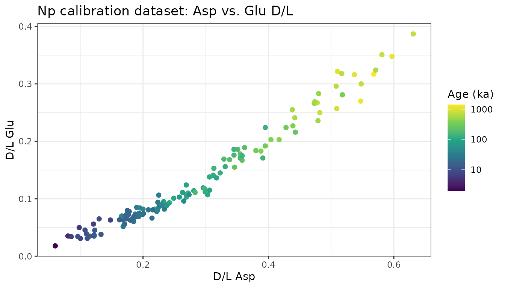
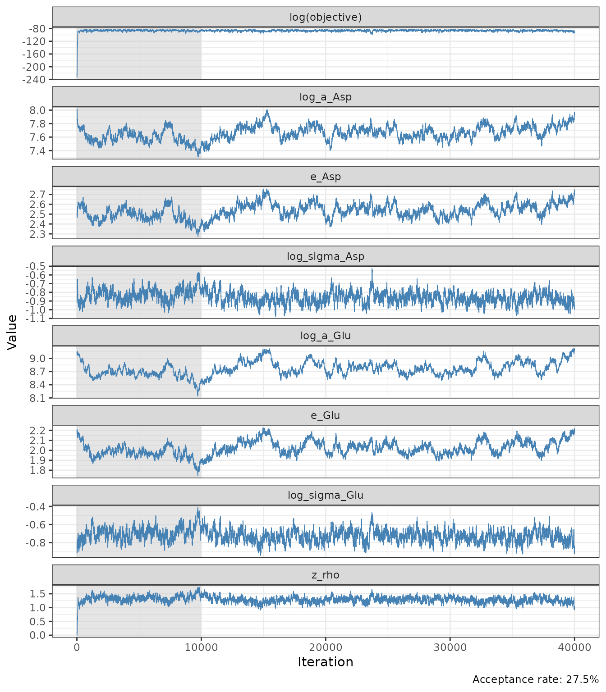
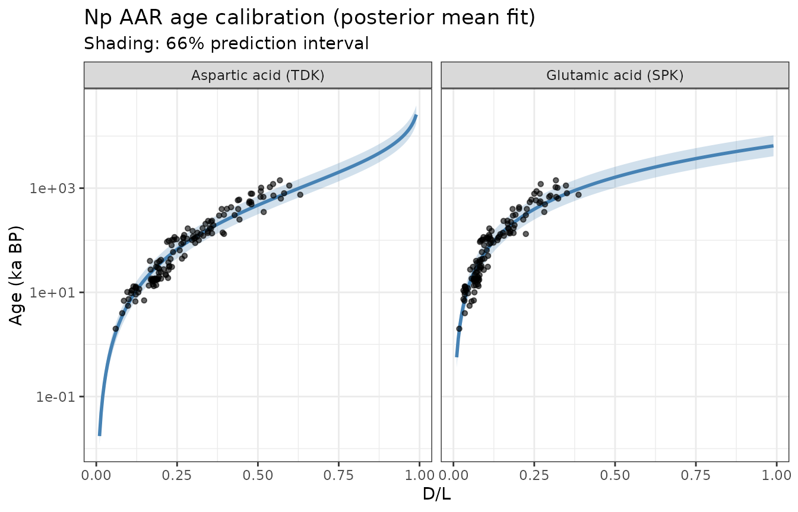
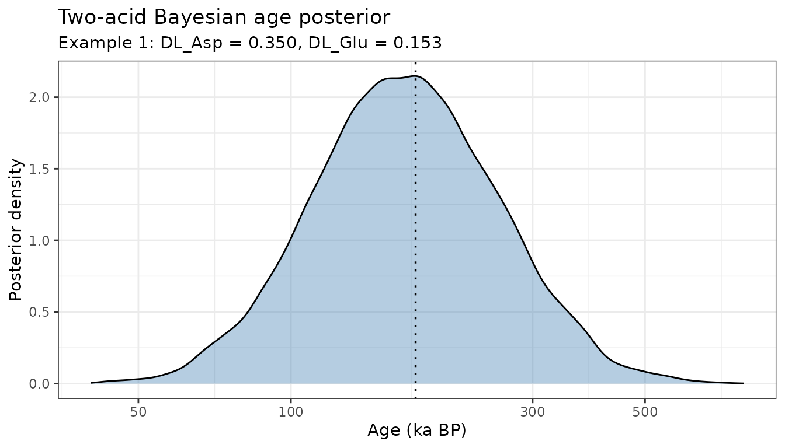
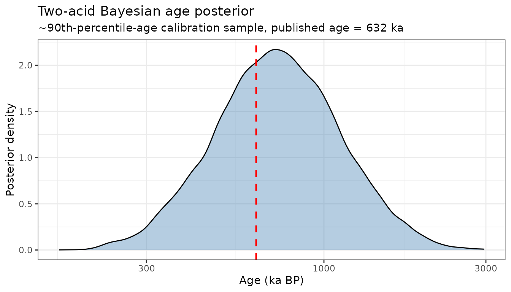

# Two-Acid Bayesian Age Inversion (Asp + Glu)

## Overview

The vignettes so far treat AAR as a **paleothermometer**: kinetics are
calibrated from lab heating experiments and a known-temperature core
([`vignette("kinetics-fitting")`](https://nickmckay.github.io/AARP/articles/kinetics-fitting.md)),
then an unknown temperature history is inferred from a single amino
acid’s downcore D/L profile
([`vignette("temperature-reconstruction")`](https://nickmckay.github.io/AARP/articles/temperature-reconstruction.md)).

This vignette turns the same machinery around and uses it for **AAR
geochronology**: dating a fossil sample from its D/L ratio, given an
independently-dated calibration set. The approach follows an in-prep
calibration study of *Neogloboquadrina pachyderma* (Np), the dominant
planktonic foraminifer in polar and subpolar oceans, which is dated
using aspartic acid (Asp) and glutamic acid (Glu) simultaneously
(Kaufman et al., in prep.). Bottom water at these high-latitude sites
stays close to freezing across glacial-interglacial cycles, so
temperature is treated as approximately constant and age becomes the
unknown to solve for – the mirror image of the
temperature-reconstruction problem.

Combining two amino acids is valuable because each has its own
calibration scatter, and a sample’s true age is more tightly constrained
by two partly independent lines of evidence than by either alone. The
original study combines Asp and Glu ages by **generalized least squares
(GLS)**, weighting each acid’s age estimate by its inverse variance and
their covariance. That approach works, but the raw GLS weight can go
negative when the two acids are highly correlated, requiring an ad hoc
“softplus” floor to keep both weights positive.

Here we build a **two-stage Bayesian MCMC model** that reuses this
package’s existing
[`run_mcmc()`](https://nickmckay.github.io/AARP/reference/run_mcmc.md)
sampler and plotting utilities:

- **Stage 1** fits Bayesian TDK (Asp) and SPK (Glu) calibration curves
  jointly, with a correlated bivariate-normal residual structure, to a
  real 128-sample Np calibration dataset.
- **Stage 2** infers a full posterior distribution for a new sample’s
  age from its Asp and Glu D/L, using the two acids’ evidence jointly
  through that same correlated likelihood.

Because this is an ordinary Bayesian posterior rather than an algebraic
GLS combination, the two acids combine coherently for any value of the
correlation – no floor or smoothing constant is needed – and the model
can just as easily incorporate a genuine prior (e.g. a stratigraphic age
range) if one is available.

## Calibration models

Following Allen et al. (2013), Asp D/L-age data are best described by
**time-dependent kinetics (TDK)**, and Glu by **simple power-law
kinetics (SPK)**:

``` math
t_\mathrm{Asp} = a_\mathrm{Asp} \cdot \mathrm{atanh}(D/L_\mathrm{Asp})^{e_\mathrm{Asp}}
\qquad
t_\mathrm{Glu} = a_\mathrm{Glu} \cdot (D/L_\mathrm{Glu})^{e_\mathrm{Glu}}
```

[`predict_age_asp()`](https://nickmckay.github.io/AARP/reference/predict_age_asp.md)
/
[`predict_age_glu()`](https://nickmckay.github.io/AARP/reference/predict_age_glu.md)
implement these forward (D/L $`\to`$ age) transforms;
[`predict_DL_asp()`](https://nickmckay.github.io/AARP/reference/predict_DL_asp.md)
/
[`predict_DL_glu()`](https://nickmckay.github.io/AARP/reference/predict_DL_glu.md)
are their inverses.

## The calibration dataset

The package includes the 128-sample Np calibration dataset (Arctic
Ocean, Nordic Seas, North Atlantic, and Southern Ocean cores; ages 2 ka
to 1.4 Myr), compiled for the in-prep calibration study.

``` r

np_path <- system.file("extdata", "np_calibration.csv", package = "AARP")
np      <- read.csv(np_path)

cal_data <- data.frame(age_ka = np$age_ka, DL_Asp = np$DL_Asp, DL_Glu = np$DL_Glu)
nrow(cal_data)
#> [1] 128
head(cal_data)
#>   age_ka DL_Asp DL_Glu
#> 1      7  0.148  0.063
#> 2    115  0.242  0.093
#> 3    401  0.404  0.203
#> 4    602  0.442  0.241
#> 5    785  0.478  0.267
#> 6   1020  0.510  0.322
```

``` r

ggplot(np, aes(x = DL_Asp, y = DL_Glu, colour = age_ka)) +
  geom_point(size = 1.8) +
  scale_colour_viridis_c(trans = "log10", name = "Age (ka)") +
  labs(x = "D/L Asp", y = "D/L Glu",
       title = "Np calibration dataset: Asp vs. Glu D/L") +
  theme_bw()
```



## Stage 1: Bayesian calibration fit

Both acids are measured on the same dated samples, so their residuals
from the mean age-D/L trend are expected to covary: a sample that
racemizes a bit faster than average tends to do so in both amino acids.
[`log_lik_age_calibration()`](https://nickmckay.github.io/AARP/reference/log_lik_age_calibration.md)
models this directly with a bivariate normal likelihood on the two
acids’ log-age residuals at each calibration sample, sharing a single
correlation parameter `rho`.

Priors on the six calibration parameters plus `rho` are weakly
informative, centred on typical literature values but wide enough that
~128 samples dominate the posterior:

| Parameter      | Prior                 |
|:---------------|:----------------------|
| log(a_Asp)     | Normal(log(3000), 3)  |
| e_Asp          | Normal(2.5, 2)        |
| log(sigma_Asp) | Normal(log(0.4), 1.5) |
| log(a_Glu)     | Normal(log(9000), 3)  |
| e_Glu          | Normal(2.2, 2)        |
| log(sigma_Glu) | Normal(log(0.4), 1.5) |
| z_rho          | Normal(0, 1)          |

``` r

init_cal <- c(log_a_Asp = log(3000), e_Asp = 2.5, log_sigma_Asp = log(0.4),
             log_a_Glu = log(9000), e_Glu = 2.2, log_sigma_Glu = log(0.4),
             z_rho = 0)

prop_cal <- c(log_a_Asp = 0.02, e_Asp = 0.015, log_sigma_Asp = 0.03,
             log_a_Glu = 0.02, e_Glu = 0.015, log_sigma_Glu = 0.03,
             z_rho = 0.06)

set.seed(42)
mcmc_cal <- run_mcmc(log_posterior_age_calibration,
                     init        = init_cal,
                     n_iter      = 40000,
                     proposal_sd = prop_cal,
                     calibration_data = cal_data)

cat("Acceptance rate:", round(mcmc_cal$acceptance_rate * 100, 1), "%\n")
#> Acceptance rate: 27.5 %
```

### Trace plots

``` r

plot_mcmc_chains(mcmc_cal, burnin = 10000)
```



### Posterior calibration constants

``` r

calib_params <- summarize_calibration(mcmc_cal, burnin = 10000)
calib_params
#> $a_Asp
#> [1] 2170.766
#> 
#> $e_Asp
#> [1] 2.547859
#> 
#> $sigma_Asp
#> [1] 0.4202709
#> 
#> $a_Glu
#> [1] 6636.33
#> 
#> $e_Glu
#> [1] 2.034293
#> 
#> $sigma_Glu
#> [1] 0.4822469
#> 
#> $rho
#> [1] 0.8564523
```

For comparison, the study’s independently fitted OLS constants are
$`a_\mathrm{Asp} = 2872`$, $`e_\mathrm{Asp} = 2.76`$,
$`a_\mathrm{Glu} = 9581`$, $`e_\mathrm{Glu} = 2.20`$, $`\rho = 0.825`$.
The joint Bayesian fit recovers a similar correlation and comparable
curve shapes; the scale/exponent pair differs somewhat because the joint
likelihood optimizes both curves’ fit *and* their shared residual
structure simultaneously, rather than fitting each acid’s OLS regression
independently.

### Fitted curves vs. data

``` r

plot_age_calibration_fit(mcmc_cal, cal_data, burnin = 10000)
```



## Stage 2: two-acid age inversion

With the calibration posterior summarised, we can now infer a full age
posterior for any new sample given its Asp and Glu D/L.
[`invert_two_acid_age()`](https://nickmckay.github.io/AARP/reference/invert_two_acid_age.md)
runs a one-parameter MCMC chain on $`\log(\mathrm{age})`$, using
[`log_lik_two_acid_age()`](https://nickmckay.github.io/AARP/reference/log_lik_two_acid_age.md)
to jointly evaluate both acids’ evidence through the shared correlated
residual structure fit in Stage 1, and a weak bounded prior
([`log_prior_age()`](https://nickmckay.github.io/AARP/reference/log_prior_age.md))
that only rules out ages far outside the calibration range – easy to
tighten if independent age information (e.g. stratigraphic order) is
available.

### Validation against the published GLS calculator

Two worked examples from the study’s spreadsheet calculator provide a
direct check: their GLS-combined ages and 66% (“likely”) prediction
intervals can be compared against our Bayesian posterior for the same
D/L inputs.

``` r

examples <- list(
  "Example 1" = list(DL_Asp = 0.350, DL_Glu = 0.153,
                     gls_median = 176.25, gls_lo66 = 119.47, gls_hi66 = 260.03),
  "Example 2" = list(DL_Asp = 0.272, DL_Glu = 0.110,
                     gls_median = 82.59, gls_lo66 = 49.97, gls_hi66 = 136.52)
)

set.seed(1)
mcmc_examples <- lapply(examples, function(ex) {
  invert_two_acid_age(DL_Asp_obs = ex$DL_Asp, DL_Glu_obs = ex$DL_Glu,
                      calib_params = calib_params, n_iter = 30000)
})

comparison <- do.call(rbind, lapply(names(examples), function(nm) {
  post <- summarize_age_posterior(mcmc_examples[[nm]], burnin = 5000)
  data.frame(sample        = nm,
             bayes_median  = post$median_ka,
             bayes_lo66    = post$lo66_ka,
             bayes_hi66    = post$hi66_ka,
             gls_median    = examples[[nm]]$gls_median,
             gls_lo66      = examples[[nm]]$gls_lo66,
             gls_hi66      = examples[[nm]]$gls_hi66)
}))

knitr::kable(comparison, digits = 1)
```

| sample    | bayes_median | bayes_lo66 | bayes_hi66 | gls_median | gls_lo66 | gls_hi66 |
|:----------|-------------:|-----------:|-----------:|-----------:|---------:|---------:|
| Example 1 |        167.8 |      112.8 |      252.0 |      176.2 |    119.5 |    260.0 |
| Example 2 |         84.3 |       56.9 |      125.4 |       82.6 |     50.0 |    136.5 |

The Bayesian posterior medians and 66% credible intervals closely track
the spreadsheet’s GLS point estimates and prediction intervals,
confirming the joint likelihood is doing the same job as the GLS
combination – while avoiding its softplus weight-flooring step entirely.

``` r

plot_age_posterior(mcmc_examples[["Example 1"]], burnin = 5000,
                   compare_ages_ka = c("GLS combined" = 176.25)) +
  labs(subtitle = "Example 1: DL_Asp = 0.350, DL_Glu = 0.153")
```



### Recovering known ages from the calibration set

As a further check, we invert the age of three calibration samples near
the 10th, 50th, and 90th percentiles of the dataset’s age distribution,
using their measured D/L but *not* their published age, and compare the
recovered posterior to the known value. (The very oldest samples are
avoided here: as in the original study’s own leave-one-out
cross-validation, the calibration is least precise – and mildly biased
young – at its oldest extreme, where calibration samples are sparsest.)

``` r

age_quantiles <- stats::quantile(np$age_ka, c(0.1, 0.5, 0.9))
check_idx     <- sapply(age_quantiles, function(q) which.min(abs(np$age_ka - q)))

set.seed(2)
mcmc_known <- lapply(check_idx, function(i) {
  invert_two_acid_age(DL_Asp_obs = np$DL_Asp[i], DL_Glu_obs = np$DL_Glu[i],
                      calib_params = calib_params, n_iter = 30000)
})

known_summary <- do.call(rbind, lapply(seq_along(check_idx), function(k) {
  i    <- check_idx[k]
  post <- summarize_age_posterior(mcmc_known[[k]], burnin = 5000)
  data.frame(UAL = np$UAL[i], published_age_ka = np$age_ka[i],
             posterior_median_ka = post$median_ka,
             lo66_ka = post$lo66_ka, hi66_ka = post$hi66_ka)
}))

knitr::kable(known_summary, digits = 1)
```

| UAL  | published_age_ka | posterior_median_ka | lo66_ka | hi66_ka |
|:-----|-----------------:|--------------------:|--------:|--------:|
| 7440 |             11.6 |                12.8 |     8.6 |    19.0 |
| 8188 |             88.8 |               115.0 |    77.0 |   171.2 |
| 8194 |            631.6 |               727.3 |   487.2 |  1088.5 |

``` r

plot_age_posterior(mcmc_known[[3]], burnin = 5000,
                   true_age_ka = np$age_ka[check_idx[3]]) +
  labs(subtitle = paste0("~90th-percentile-age calibration sample, published age = ",
                         round(np$age_ka[check_idx[3]]), " ka"))
```



The recovered posteriors bracket the published ages within their
credible intervals, as expected for samples that were themselves part of
the calibration fit.

## Why Bayesian?

The GLS approach implemented in the spreadsheet calculator is fast and
transparent, and this vignette confirms our Bayesian model reproduces it
closely. The Bayesian formulation offers a few things the GLS calculator
does not, at the cost of running an MCMC chain instead of evaluating a
formula:

- **No ad hoc weight flooring.** When Asp and Glu are highly correlated,
  the GLS weight on the less-precise acid can go negative, requiring a
  smoothed floor (`s`, `w` in the spreadsheet) to keep the combination
  well-behaved. The joint likelihood here never produces a negative
  “weight” because there isn’t one – both acids simply contribute
  evidence to one posterior.
- **Priors.**
  [`log_prior_age()`](https://nickmckay.github.io/AARP/reference/log_prior_age.md)
  is an ordinary Bayesian prior. If a stratigraphic constraint, a
  minimum/maximum age, or another proxy’s age estimate is available for
  a sample, it can be folded in directly by tightening `range_ka` or
  swapping in an informative density, sharpening the posterior beyond
  what the D/L data alone provide.
- **Full posterior, not just symmetric log-normal bands.** The three
  “more likely than not / likely / very likely” IPCC-style bands in the
  spreadsheet are read off an assumed log-normal shape; here they are
  genuine empirical quantiles of the sampled posterior, which can depart
  from log-normality when the prior’s age bound becomes informative.
- **Reuses the same MCMC infrastructure** as the
  temperature-reconstruction workflow
  ([`run_mcmc()`](https://nickmckay.github.io/AARP/reference/run_mcmc.md),
  [`plot_mcmc_chains()`](https://nickmckay.github.io/AARP/reference/plot_mcmc_chains.md)),
  so the two problems – inferring temperature from a single acid, and
  inferring age from two – are solved with one consistent Bayesian
  toolkit.

One simplification relative to the full study: the likelihood here uses
only the calibration-scale residual variance (`sigma_Asp`, `sigma_Glu`),
not the additional analytical-measurement-uncertainty term the study
adds via each sample’s replicate SE. The study finds that term
contributes roughly 1% of total variance for typical replicate counts,
so this simplification has little practical effect, but a per-sample
measurement-uncertainty term could be added to
[`log_lik_two_acid_age()`](https://nickmckay.github.io/AARP/reference/log_lik_two_acid_age.md)
if replicate SEs are known to be unusually large.
